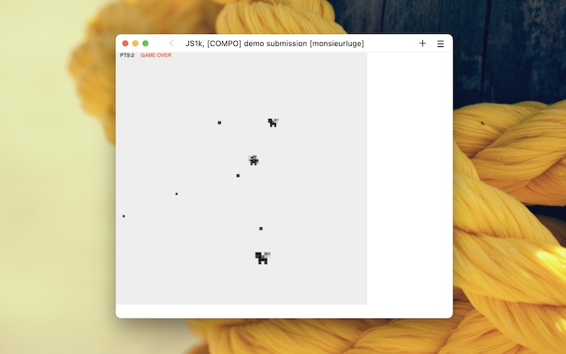

# JS1K 2014 - Dragons

<a href="https://github.com/monsieurluge/js1k-2014" target="_blank">sources</a>

## JS1K ?

<a href="https://js1k.com" target="_blank">JS1K</a> est (était) une compétition annuelle similaire aux _game-jam_ dont la contrainte forte, au delà du thème et du temps limité, est que le code soumis ne doit pas dépasser _1024 bytes_. C'est peu. Vraiment peu =]

## Des dragons

Le thème de <a href="https://js1k.com/2014-dragons/" target="_blank">l'année 2014</a> fut "dragons". À la découverte du concours avec deux collègues et amis nous nous sommes motivés pour participer ; échanger des astuces pour faire rentrer quelque chose de fonctionnel dans si peu de place.

Bien que motivés, je fus le seul à soumettre un projet dont voici le descriptif tout aussi bizarre que le jeu en lui même :

> Marcel VS the Ugly Angry Little Dragons ** Slain as many ugly-angry-little-dragons as possible before you die (Yes, you'll die... sorry) ! Use the arrow keys to move and click to fire a bullet. Be very careful and die as a hero !

Comme chaque année <a href="https://js1k.com/2014-dragons/demos" target="_blank">les propositions</a> furent de qualité. Comme quoi, même avec de grosses limitations on peut arriver à quelque chose.

## Le gameplay

Est-ce qu'on peut encore parler de _gameplay_ à ce niveau ; la question se pose =]

Dès le lancement de la démo le personnage se met en mouvement, suivi par un dragon cracheur de feu. Les touches fléchées permettent de changer la direction du personnage et un clic le fait tirer dans la direction du curseur de la souris.

Attention, vous n'avez le droit qu'à un seul tir à la fois. Tant que ce dernier n'a pas touché de cible ou n'est pas sorti de l'écran il n'est pas possible de tirer à nouveau. La précision est de mise.

Une fois le dragon éliminé il est remplacé par deux dragons à la taille et aux tirs de plus en plus gros. Puis trois dragons. Etc, jusqu'à ce que mort s'ensuive.

C'est jouable <a href="https://js1k.com/2014-dragons/demo/1822" target="_blank">ici</a>. Bon courage !

## Ce que ça m'a apporté

Travailler sur ce jeu miniature m'a fait sortir de ma zone de confort et obligé à trouver des astuces (hacks) pour gagner le moindre caractère. C'était à la fois frustrant et grisant. Et dire que je n'ai fait qu'éfleurer ce domaine dans lequel certains excellent !

Cet exercice n'a fait que confirmer que j'aime travailler en équipe (ou au sein d'une communauté), et que la simplicité est mon mantra ; je fais partie de ceux qui s'inquiétent de l'empreinte énergétique et de la place qu'occupent nos applications.
