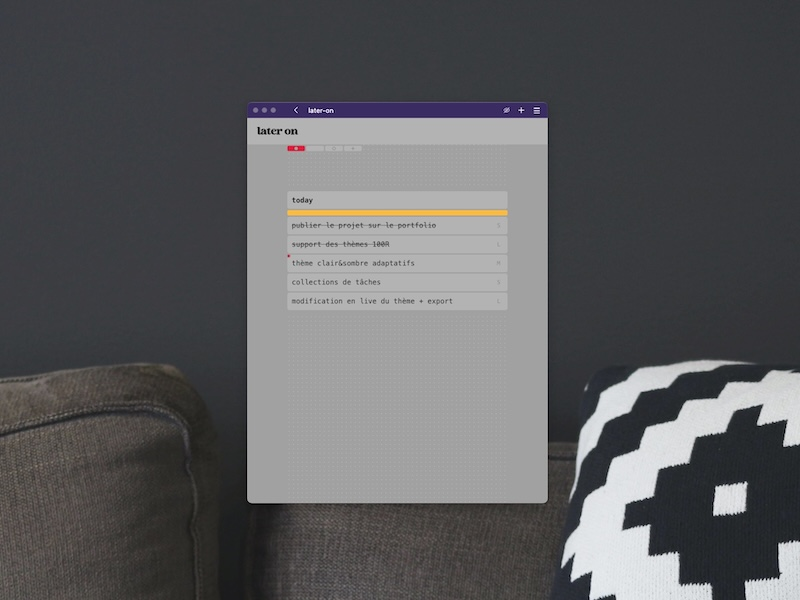
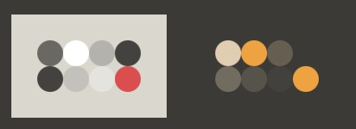

# Later On

<a href="https://github.com/monsieurluge/later-on" target="_blank">sources</a> | <a href="https://later-on.monsieurluge.dev/" target="_blank">démo</a>

Il y a TODO list, et TODO list.

## Présentation

**Later On** est une application web de gestion de tâches ; ou "TODO list" pour faire plus simple.

Je souhaitais pouvoir être en mesure de présenter un projet entièrement réalisé en VueJS, simple mais complet dans sa proposition. L'idée de partir sur un projet qui est régulièrement utilisé dans les tutoriels et ce quelque soit le langage ou framework m'a séduite et il me fallait en développer une version améliorée ; quelque chose qui fasse la différence entre l'apprentissage et l'expérience.

Mes sources d'inspiration ont été <a href="https://www.tomorrow.do" target="_blank">Do It Tomorrow</a> pour l'idée de reporter les tâches à plus tard, et <a href="https://aeriform.itch.io/tape" target="_blank">Tape</a> pour le design global. Deux applications que j'utilise fréquemment pour mes besoins personnels.

## Fonctionnalités

Il y a tout ce dont on attend d'une liste de tâches :

- ajout
- renommage
- réorganisation
- mise à "terminé"
- suppression

Mais également, sans ordre de priorité :

- report des tâches au lendemain, ou l'art de la procrastination
- suppression automatique des tâches terminées lors du changement de jour (*)
- déplacement automatique des tâches lors du changement de jour (*)
- attribution d'un _poids_ aux tâches
- gestion automatique des thèmes
- prise en charge de thèmes personnalisés
- collections de tâches
- prise en charge de plusieurs langues (*)
- raccourcis claviers configurables (*)
- statistiques d'utilisation (*)

> \* il est possible que certaines de ces fonctionnalités soient encore en cours de développement au moment où vous lirez ces lignes

## Défis relevés

Une liste de tâches est un projet simple. Mais derrière la simplicité apparente se cache toujours une dose de complexité, surtout lorsqu'on souhaite que l'utilisateur soit à l'aise dans la manipulation de l'application.

### déplacement des tâches

J'ai fait le choix de ne pas utiliser de librairie tierce (comme <a href="https://github.com/bevacqua/dragula/tree/master" target="_blank">Dragula</a> ou <a href="https://github.com/SortableJS/Sortable" target="_blank">SortableJS</a> pour ne citer qu'elles) pour le déplacement des éléments de liste pour deux raisons principales : ne pas alourdir le projet car je ne comptais pas exploiter toutes leurs fonctionnalités, et gagner en compétences sur la manipulation native des objets.

La gestion d'une manipulation aussi banale que le glisser-déposer est plus complexe à mettre en oeuvre qu'il n'y paraît, surtout lorsque plusieurs zones de dépôt sont définies et proposent des comportements spécifiques. De plus, rendre la manipulation fluide et compréhensible pour l'utilisateur n'est pas chose aisée et demande de nombreux ajustements.

### mode édition

:information_source: Cette fonctionnalité est encore en cours de développement et va connaître quelques changements. D'ici sa stabilisisation cette section reste à l'état de brouillon.

Pour renommer ou supprimer une tâche il y a le mode "édition" disponible au clic sur le bouton prévu à cet effet. Tant qu'il est actif il permet de modifier toutes les tâches.

Une fois encore, l'action est très banale. Cependant la réflexion nécessaire pour rendre l'expérience fluide pour l'utilisateur, ainsi que la gestion des états de l'application et des comportements associés ne sont pas anodines et peut mener rapidement à du code difficile à maintenir.

### design global

Je souhaitais proposer un design extrêmement épuré mais fonctionnel. N'étant pas UX designer cette contrainte pesa lourd dans la conception de l'interface, dans la création des composants et de leurs intéractions. Sans compter que le travail est loin d'être terminé...

Voici quelques contraintes de design que j'ai suivies et auxquelles je me plie depuis le démarrage du projet :

- largeur réduite et fixe pour le contenu principal, quelque soit la résolution de l'affichage
- nombre d'éléments affichés en même temps limité à l'extrême
- thème ultra personnalisable (cf. section ci-dessous)

## Thèmes

Pour la gestion des thèmes j'ai suivi les mêmes principes que pour ce portfolio, à savoir une compatibilité complète avec les thèmes proposés par le groupement d'artistes <a href="https://100r.co/site/home.html" target="_blank">Hundred Rabbits</a> dont j'apprécie beaucoup les travaux et la philosophie de vie.

_Later On_ propose par défaut deux thèmes, un sombre et un clair, qui changent au gré des paramètres du navigateur ou du système de l'utilisateur. Chacun de ces thèmes peut être remplacé par simple glisser-déposer de fichier de thème compatible.

Le challenge lié à l'utilisation d'un set de couleurs externe et la non maîtrise des couleurs ainsi appliquées fut très intéressant à relever bien que consommateur en temps. Expérimentations, tâtonnement, tests ; je suis globalement satisfait du résultat. À voir ce que ça peut lever comme problématiques sur une application bien plus complexe !

Pour en savoir plus : [exemple avec la gestion des thèmes du portfolio](/themes).
