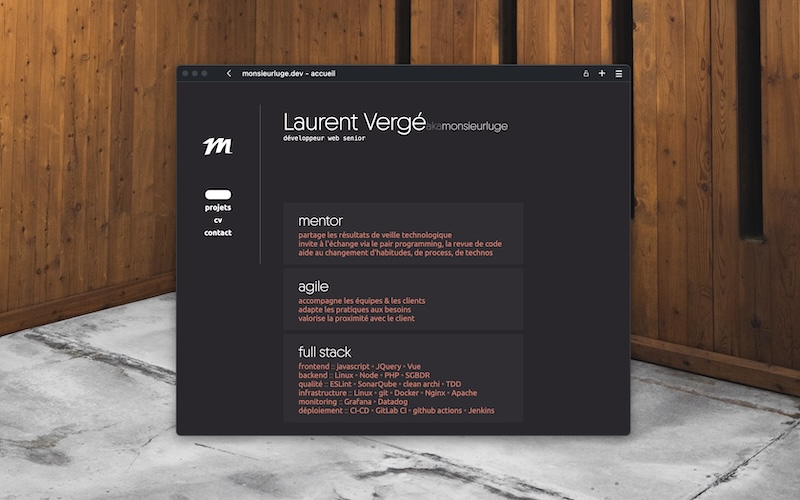

# Portfolio

## Un mal nécessaire

Pouvoir présenter ce que j'ai pu produire sur mon temps personnel, quelqu'en soit l'état d'avancement et la qualité dudit contenu, est devenu une nécessité. Demander à des personnes d'aller fouiller mon <a href="https://github.com/monsieurluge" target="_blank">dépôt github</a> pour en savoir un peu plus sur moi n'est pas convenable et il me fallait faire quelque chose.

## Le choix technologique

Après de nombreux tests infructueux, de plateformes qui ne m'inspirent pas grand chose, mon dévolu s'est porté sur <a href="https://astro.build/" target="_blank">Astro</a>, un framework web orienté contenu qui finalement correspond bien à ce que je cherche. Je n'ai pas la prétention de produire du contenu lêché ni de chercher à mettre des paillettes partout (exemple avec le site de <a href="https://beta.stripe.dev" target="_blank">Stripe</a> qui en envoie plein la tête mais qui rame sur un Macbook M1), je veux simplement pouvoir présenter qui je suis de la manière qui me correspond le plus.

Astro permet de produire un site statique optimisé ne contenant que le strict nécessaire ce qui correspond parfaitement aux valeurs que je défends, sans sacrifier la possibilité d'avoir du contenu dynamique. La communauté est très active ce qui est un plus non négligeable.

L'hébergement est chez <a href="https://www.hostinger.fr/" target="_blank">Hostinger</a>, et la gestion du formulaire de contact est assurée par <a href="https://web3forms.com/" target="_blank">Web3Forms</a>.

## Minimalisme

Friand de minimalisme j'ai volontairement choisi cette voie pour la création de ce portfolio. Framework léger, pas de librairie externe, thème sobre mais modulable, template de page le plus simple possible utilisant au maximum les balises de base, tout concourt à coller à ma façon de voir les choses sans me restreindre dans mes choix.

Les thèmes disponibles utilisent tous la même base et peuvent être remplacés par un simple glisser-déposer de fichier sur la page. Plus d'informations [ici](/themes).

## Joindre l'utile à l'agréable

Concevoir ce portfolio me permet surtout d'ajouter des bonus qui sortent du cadre professionnel.

La galerie photo par exemple présente l'une des activités que j'aime beaucoup mais que je n'ai pas l'occasion de pratiquer régulièrement surtout depuis la naissance de mes deux garçons. J'apprécie les photos peu retouchées (les derniers spots de pub pour le Google Pixel me font bondir), prises en conditions naturelles et parfois présentées malgré des défauts techniques.

Il en va de même pour tout ce qui tourne autour du jeu de société, loisir au combien intéressant et en constante croissance, permettant de se détendre, rencontrer plein de monde, et faire travailler les neurones.

Merci de m'avoir lu.
