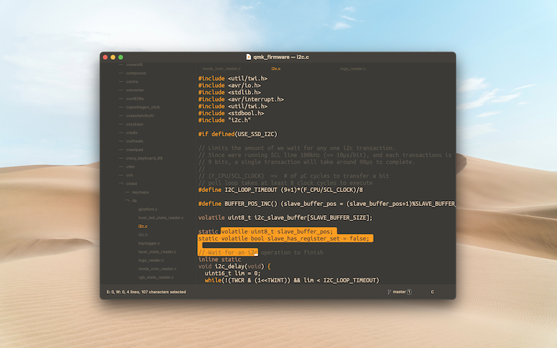

# Sand Storm

<a href="https://github.com/monsieurluge/sublime-text-sandstorm-theme/" target="_blank">sources</a>

## Un thème sombre minimaliste

J'aime le minimalisme, c'est un fait. Pouvoir travailler dans un environnement épuré, libre de toute information inutile, est et reste une recherche permanente.

**Sublime Text** propose beaucoup d'options de personnalisation dont la création de **thèmes**. Il me fallait donc sauter sur l'occasion et en créer un qui me correspond.

## Objectifs

Les éditeurs modernes offrent de nombreux automatismes et raccourcis, mon but ici est donc de se reposer dessus afin de proposer une interface la plus minimaliste possible tout en restant efficace.

- masquer tout ce qui peut facilement être affiché ou obtenu via un raccourci
- mise en avant du code source
- mise en avant des blocs de code et des structures de contrôle principales
- réduction du nombre de couleurs affichées sans nuire à la lisibilité
- réduction de la fatigue visuelle
- facilement modifiable via un jeu de variables réduit

Le projet s'accompagne de quelques conseils pour réduire la charge visuelle liée aux informations affichées par défaut. Je n'ai pas cherché à intégrer ces modifications dans le thème car tout dépend des goûts et habitudes de chacun cependant elles sont listées dans le README.
