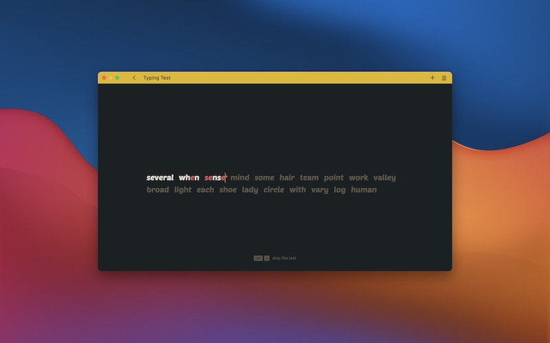

# Typing Test

<a href="https://github.com/monsieurluge/typing-test" target="_blank">sources</a> | <a href="https://typing-test.monsieurluge.dev" target="_blank">démo</a>

## Introduction

Dans ma recherche du "clavier parfait" je suis tombé sur de nombreux outils permettant d'améliorer et tester sa frappe ; précision, rapidité, etc. L'un d'eux m'a particulièrement marqué de part son esthétique et sa praticité : <a href="https://monkeytype.com" target="_blank">Monkey Type</a>.

Cependant, partant d'un idée minimaliste cet outil/site s'est grandement développé et a intégré toujours plus de fonctionnalités et liants externes, rendant selon mon point de vue l'expérience fastidieuse. Je ne suis pas client de ce genre d'ajouts.

L'envie de "faire pareil" a donc émergé.

## Contraintes

J'ai volontairement cherché à produire une application légère qui peut se lancer immédiatement, sans étape de _build_, sans librairie externe.

En milieu pro il est normal d'utiliser tous les outils mis à notre disposition, que ce soit des frameworks, de l'analyse statique, de la compilation/transpilation, etc. Lorsque je travaille sur un projet perso j'aime à retourner à la simplicité et n'utiliser ces outils que dans certains cas précis (ex : bénéficier du _hot reloading_, vérifier les sources).

## Utilisation

L'application se veut immédiatement utilisable. La page est affichée avec des mots à écrire et le curseur nous invite se lancer. Les paramètres par défaut sont suffisants pour comprendre ce qu'on attend de nous.

Quelques raccourcis mis à disposition invitent à ne pas lâcher le clavier afin de se concentrer sur l'essentiel : améliorer sa mémoire musculaire. Voici les principaux :

- ctrl+c : arrêter le test en cours
- shift+n : démarrer un autre test
- shift+r : relancer le même test

Tout se veut accessible au clavier. Il ne reste plus qu'à se lancer !

## La suite ?

Il me reste quelques modifications à apporter au projet cependant je ne me suis donné aucun objectif temporel. Lorsque j'en ressentirai l'envie ou qu'une modification dans la disposition de l'un de mes claviers me poussera à changer mes habitudes de frappe le projet subira des changements.

En vrac j'ai en tête :

- proposer au moins une autre langue, le français
- s'entraîner à taper du code + symboles plutôt que des mots du dictionnaire
- gestion de thèmes
- enregistrement (local) des stats pour suivre sa progression
