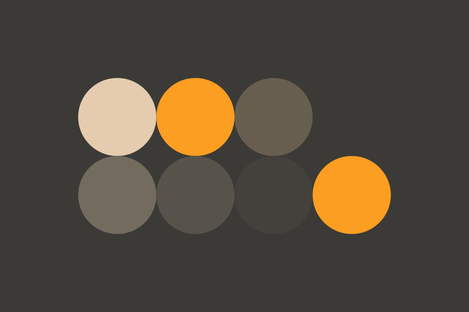
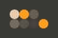
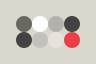
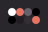
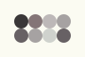

# Thèmes

Le site a été créé dès le départ avec comme objectif d'être compatible avec les thèmes utilisés par <a href="https://github.com/hundredrabbits" target="_blank">les outils</a> du collectif d'artistes <a href="https://100r.co/site/home.html" target="_blank">Hundred Rabbits</a>.

Leur philosophie tournée vers le minimalisme, les problématiques de consommation énergétique, la maintenance de vieux matériel ainsi que l'accès très limité au réseau internet m'inspire toujours autant. J'ai souhaité leur rendre un hommage discret en rendant mon site compatible avec leurs thèmes tout en respectant le plus possible les problématiques qui leur sont chères.

## Composition d'un thème

Chaque thème est décrit dans un fichier SVG permettant en un coup d'oeil de connaître les couleurs qui vont être utilisées sur le site ou les applications compatibles.

Un thème est composé d'une couleur de fond principale, de 4 couleurs de texte, et de 4 couleurs de fond.

La plupart du temps la 2ème couleur de texte correspond à une couleur mettant en avant les éléments importants.

## Thèmes du site

4 thèmes sont proposés par défaut sur le site. Il est possible d'appliquer un nouveau thème en déposant sur la page un fichier SVG de thème compatible (cf. ressources). Le thème sera appliqué automatiquement et sauvegardé dans le stockage local du navigateur.

**sandstorm** est le thème sombre par défaut. Il est basé sur le thème du même nom que j'ai créé pour l'éditeur de code Sublime Text (voir [page correspondante](http://localhost:1234/projects/sandstorm)).

**tape** est le thème clair par défaut. Il est tiré de la liste des thèmes proposés par le collectif d'artistes et est utilisé par l'application éponyme que j'apprécie beaucoup. Cette dernière permet d'organiser son travail à la manière d'une todo list, dans un contexte très minimaliste.

**apollo** est le second thème sombre et se veut très contrasté. Il est lui aussi issu de la liste des thèmes proposés par le collectif Hundred Rabbits.

**marble** est le second thème clair, très contrasté également et ne propose pour sa part aucune couleur marquée, le faisant presque passer pour un ensemble de dégradés de gris. Il est lui aussi issu de la liste des thèmes du collectif.

## Ressources

- <a href="https://github.com/hundredrabbits/Themes" target="_blank">sources</a> du projet **Themes** du collectif Hundred Rabbits
- <a href="https://github.com/hundredrabbits/Themes/tree/master/themes" target="_blank">thèmes supplémentaires</a> du même projet
- <a href="https://aeriform.itch.io/tape" target="_blank">tape</a> by AeriForm sur itch.io
